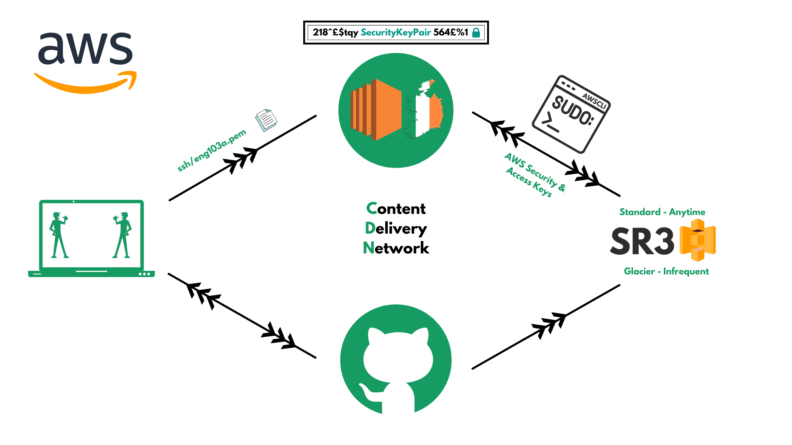

# SR3



AWSCLI<br>
AWS SEC & Access Keys<br>
Required to access SR3 from EC2 storage for CRUD
actions from any AWS zone.

Standard - Data be accessed anytime<br>
Glacier - Infrequent access to data, but cheaper<br>
CDN - Content Delivery Network<br><br>

S3 (AWS service) is simple storage service that is globally available. You can store anything.
- Used for disaster recovery
- We can apply Create bucket/object, Read, Update Delete (CRUD) actions 

- Our data is all stored on Ireland EC2 servers atm.
- In order to make it `highly available` on S3, we can use `AWSCLI` configuration with the right secure access keys. 
- Our current key is the `/ssh/eng103a.pem` file

S3 Storage Classes:
- Standard/Normal - You can access data anytime, faster, more costly
- Glacier - Infrequent data access _(you pay less for this)_, cheaper, longer, requires notice for access to data. Can only be accessed a few times. 
    _Ex: Sparta holds onto lots of personal data - current and former employees for example. Sparta needs to be able to access current employee data instantly as needed, whereas they don't need immediate access to ex-employee data._
Your data is made highly available as it is stored across 3 availability zones that are separated by a certain amount of mileage.  

### Accessing SQS

- Search for S3 on AWS (_note how when we select S3, region automatically changes to 'global'_)
- `AWSCLI` depends on Python3 to or above to install PIP3
- Ubuntu uses Python2.7 by default, so we need to ensure that we're using Python3:
```
sudo apt install update -y
sudo apt install upgrade -y
sudo apt install python3-pip -y

alias python=python3.7
sudo apt install python3.70-minimal
alias python=python3.7 <-- we do this to specify which version of Python ubunutu should use>

sudo pip3 install awscli

aws configure
AWS Access Key ID: {see excel sheet}
AWS Secret Access Key: {see excel sheet}

Default Region Name:`eu-west-1` (this is the area code of each region on AWS. Check region drop down list to find yours.)
Default output format: json
```
`aws s3 ls` - searches directories in AWS S3
On AWS site > S3 > Buckets, you should be able to see the same list

### Buckets (CreateReadUpdateDelete)

S3 does NOT allow underscores. Naming convention is different, must use `-` instead. No caps either.
aws s3

make bucket `m3` s3://eng103a-karim-devops

We now have our own bucket in S3

We'll make a file as usual: `sudo nano test.txt`

We can add a file to our bucket through `aws s3 cp test.txt s3://eng103a-karim-devops`

Downloading a file from our bucket to our local pc is the same process but with the source and destination locations reversed `aws s3 cp s3://eng103a-karim-devops ~`

To delete a bucket we use `aws s3 rb s3://`

To delete a file we use `aws s3 rm s3://eng103a-karim-devops/<FileName>`


CLI Commands: https://docs.aws.amazon.com/cli/latest/userguide/cli-services-s3-commands.html#using-s3-commands-listing-buckets

### Autoscaling and Load Balancing 

- Autoscaling _automatically adjusts_ the amount of computational resources based on the server load.
- Load balancing _distributes traffic_ between EC2 instances so that no one instance gets overwhelmed. 

*Launch Templates
*
> AWS > EC2 Dashboard > Instances Sidebar > Launch Templates > Create Template
> 
> Enter name, tick auto scaling guidance, add a tag with the same name
> 
> Quick start > Ubuntu 180.04
> 
> Instance type > t2..micro
> 
> Create security group > enter names and desc > add rule: HTTP, TCP 80, Anywhere. Add rule: ssh, TCP, 22, My IP.
> 
> Adv Details > DNS Hostname "Enable resource-based IPV4 DNS Requests". 
> Adv Details > User Data: 
> 
```
#!/bin/bash
sudo apt-get update -y
sudo apt-get upgrade -y
sudo apt-get install nginx -y
sudo systemctl restart nginx 
sudo systemctl enable nginx
```
*Auto Scaling Groups
*
> AWS > EC2 Dashboard > Auto Scaling Sidebar > Auto Scaling Groups > Create Auto Scaling Group > Enter Name > Select Launch Template: <Launch Template Name> > Version: Latest 1 > Next
> 
> Network > VPD: Default > Avail Zones and subnets: Default 1a, Default 1b, Default 1c _(make sure the port is the same on all, in this case its /20)_ > Next
> 
> Load Balancing > Attach to a new load balancer > Application Load Balancer _(this is the strongest one and provides accessibilty for HTTP and HTTPS)_ >  Name: "eng103a-karim-alb" _(note '-' naming convention)_ > Internet-facing > Default routing: Create a target group: "eng103a-karim-lg"
> 
> Health Checks > tick EC2 and ELB > 
> 
> Configure Group size and scaling policies > desired: 2, minimum: 2, maximum: 3 
> 
> Scaling policies > Target tracking scaling policy > scaling policy name: <eng103a-karim-alb> > metric type: avg cpu utilization > Target Value: 25 > Next
> 
> to Review > Create Auto Scaling Group

High Availability:
- There are always servers available in case one goes down, one runs in its place. It means that there's always a minimum # servers running that allow the service to stay up and running.

High Scalability: 
- Can your app scale in and out in response to # of users or % of CPU Utilisation. 
- If the load on the load balancer increases more than the threshold we specified, a new server will be spun up and the extra traffic will be diverted to the new one. 

Listener Groups:
- f

Cloudwatch: 
-f

SQS:
-f

User Journey:
- The user journey needs to be smooth end-to-end. 
- We need to meet the expectations set. 
- 


