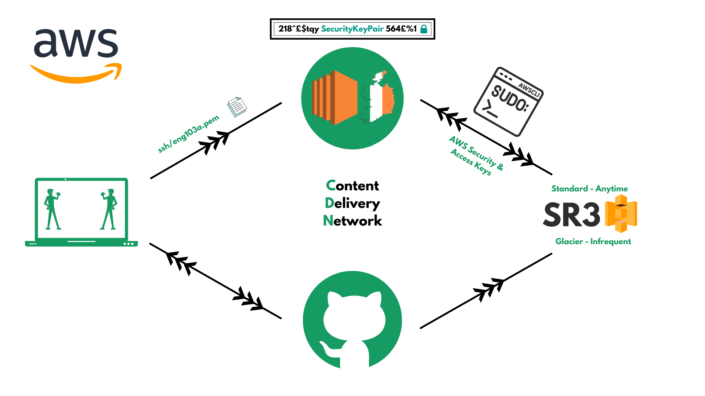

# SR3
- Simple Storage Service
- Database available on AWS
- Globally available
- DR (Disaster Recovery)
- Can store any files
- CRUD ACTIONS (Create, Bucket/Object, Read, Update, Delete)
From local host to EC2

AWSCLI 
AWS SEC & Access Keys 
Required to access SR3 from EC2 storage for CRUD
actions from any AWS zone.

Standard - Data be accessed anytime 
Glacier - Infrequent access to data, but cheaper 
CDN - Content Delivery Network  

How to access SR3: 
- Python 3 or above
- Install pip3
- Ensure to use python 3
- sudo apt install python3.7-minimal
- alias python=python3.7
- sudo pip3 install awscli
- aws configure
- Enter access key, secret key, region (eu-west-1), and json for output data type
- aws s3 ls
